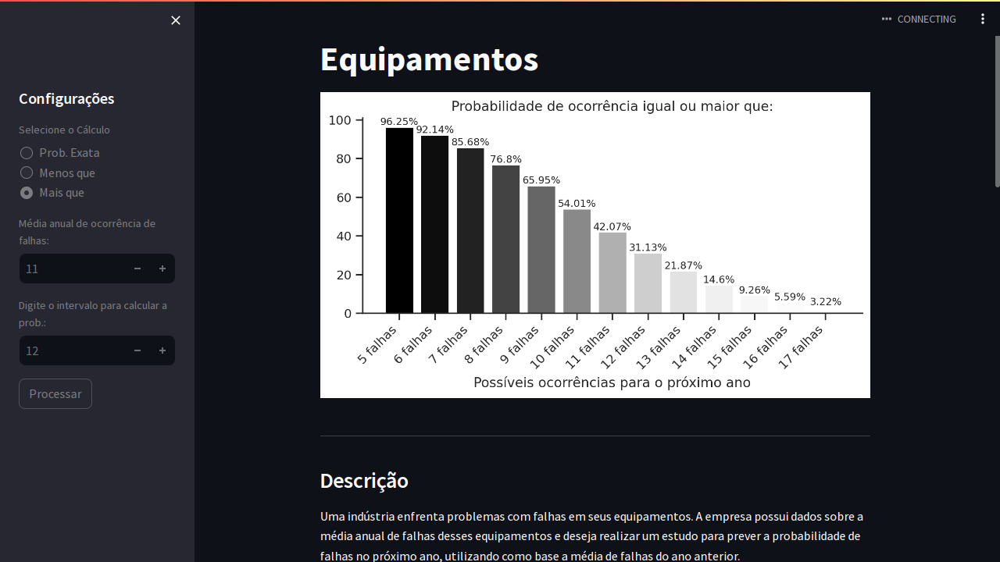

  

<h3  id="techs">Tecnologias</h3>

      
  </ul>
   

# Como usar a distribuição de Poisson para obter a probabilidade de falhas de um equipamento?

Hoje apresento um projeto que permite calcular a distribuição de probabilidade de falhas de um equipamento, utilizando a média de falhas do último ano.

Cenário Hipotético

Para exemplificar, vamos considerar uma situação hipotética em uma indústria onde existem vários equipamentos. Esses equipamentos podem falhar, resultando em paradas não programadas. Para estimar as probabilidades de ocorrência dessas falhas no próximo ano, podemos usar a distribuição de Poisson.

## Demonstração

Na demonstração abaixo, você encontrará dois campos para inserir valores:

+ Média de falhas do equipamento no último ano: Este é o parâmetro λ da distribuição de Poisson.

+ Número de falhas desejado (k): Este campo permite informar o número específico de falhas para o qual você deseja calcular a probabilidade.

Ao preencher esses campos, o gráfico de barras mostrará a probabilidade de ocorrência do número especificado de falhas no próximo ano.

  

## Explicação

Este exemplo simples mostra como utilizar a distribuição de Poisson para prever a probabilidade de falhas de um equipamento com base na média de falhas do ano anterior. A interface Streamlit permite que você insira os valores de forma interativa e veja os resultados em tempo real, facilitando a análise e a tomada de decisões.

