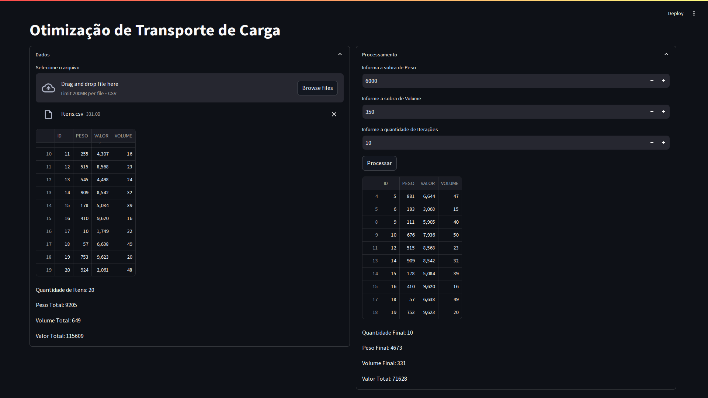

<h3  id="techs">Tecnologias</h3>

    
  </ul>
   

# Otimização do Lucro no Transporte de Carga - Algoritmos Genéticos

Otimize as operações e maximize os lucros no transporte de carga, aplicando algoritmos genéticos para encontrar soluções ótimas.

## Problema:

Uma empresa de transporte aéreo enfrenta o desafio de selecionar quais produtos transportar, dado que seu espaço de carga é limitado. Cada item possui características específicas como peso, volume e valor de transporte, e o objetivo é otimizar essa escolha para maximizar o lucro da empresa. No entanto, devido à vasta quantidade de combinações possíveis de itens, calcular a solução ideal usando força bruta seria extremamente demorado e ineficiente. Para superar essa dificuldade, a empresa decidiu implementar uma solução baseada em inteligência artificial, contratando um especialista para desenvolver um algoritmo que otimize esse processo de seleção.

## Solução:

Para otimizar o processo de escolha dos itens a serem transportados, foi escolhido um algoritmo genético, uma técnica de inteligência artificial que simula o processo de evolução natural. Esse método é eficiente na busca por soluções ótimas ou próximas do ideal em problemas complexos. O algoritmo genético trabalha minimizando o erro e encontrando a melhor combinação de itens, levando em consideração as restrições de volume e peso máximo que a aeronave pode suportar. A solução proposta não apenas otimiza o lucro total, mas também apresenta os itens selecionados para transporte, mostrando seus pesos, volumes e o valor total de lucro que a empresa obterá ao transportá-los. Assim, a empresa pode tomar decisões rápidas e eficientes sobre quais cargas são mais rentáveis, maximizando seu uso de espaço e capacidade de peso.

Na coluna à esquerda, é exibido um campo para entrada de dados, onde são carregadas as informações de todos os itens disponíveis, incluindo seus respectivos ID, peso, valor e volume. Esses dados são essenciais para o processamento e otimização da escolha dos itens.

Na coluna à direita, há campos específicos para que o usuário insira os limites operacionais da aeronave, como o **peso máximo** e o **volume máximo** que ela pode suportar, além da **quantidade de itens** que a empresa deseja transportar.

Após fornecer esses dados, ao clicar no botão `Processar`, o algoritmo genético será aplicado, analisando todas as opções possíveis. Como resultado, o sistema retornará a melhor solução, mostrando os itens selecionados, o peso e volume total utilizados, bem como o valor de lucro máximo que a empresa obterá com o transporte desses itens.

